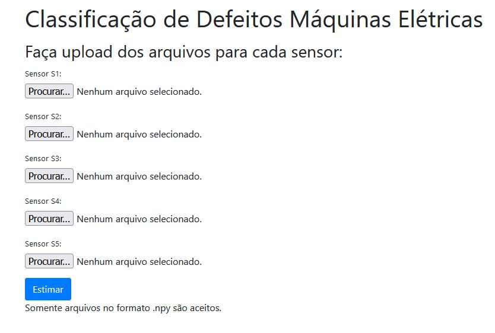
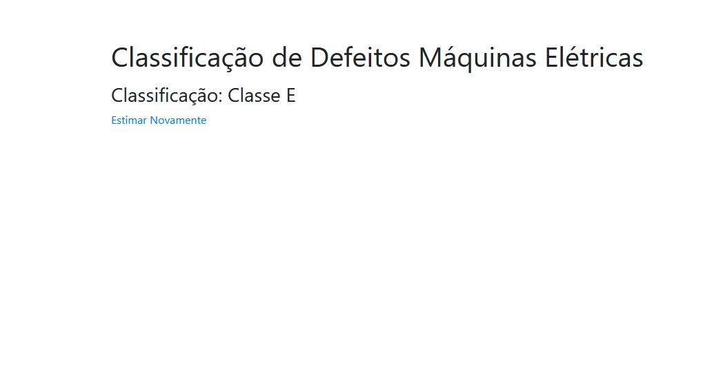

# Estudo de caso

## Apresentação do problema e contextualização

Desenvolva o Pipeline completo de um projeto de Aprendizado de Máquina, desde a Análise e preparação dos dados adquiridos até a disponibilização do algoritmo no GitHub. A aplicação de modelo Machine learning na manutenção preditiva previne falhas em equipamentos industriais ao analisar dados, evitando paradas não planejadas. Foram disponibilizados dados de 5 sensores presentes de uma máquina industrial. O objetivo é classificar com base nos dados fornecidos dos sensores os estados de funcionamentos das máquinas em Classes A, B, C, D e E, gerando um modelo de ML que identifique padrões nos dados dos sensores para realizar as classificações.

### Ressalva

O estudo de caso não indica como as previsões devem ser apresentadas ao usuário final. Isso é uma etapa importante da definição de um projeto, dependendo de como as previsões serão entregues, é preciso etapas de desenvolvimento adicionais. Portanto, optou-se em fazer a entrega do modelo em uma WebApp. Outro ponto de atenção é o nível de precisão requerido para o projeto (não foi especificado). Vamos considerar um modelo aceitável sendo com 90% ou mais de precisão. Um dos requisitos foi que o modelo fosse desenvolvido em python e usando qualquer biblioteca/framework que fosse necessário (todas estão descritas em cada arquivo do projeto juntamente com as versões utilizadas de cada framework/biblioteca).<br>

## Organização do projeto e das pastas

Os arquivos do projeto foram divididos nas seguintes pastas e arquivos:

#### Diretório --> data<br>

<li>Contém os dados brutos dos sensores.<br>
<li>Contém os dados normalizados dos sensores após o processamento.<br>
<li>Contém os dados brutos usados para teste da webapp.<br>
<li>Todos os arquivos estão em formato .npy.<br>
    
#### Diretório --> modelo<br>

<li>Contém o modelo treinado em formato .keras usado pela WebApp. <br>

#### Diretório --> notebook<br>

<li>Contém o arquivo jupyter processamento_dados.ipynb em que é realizada a ANÁLISE EXPLORATÓRIA e o PROCESSAMENTO DOS DADOS dos sensores.<br>
<li>Contém o arquivo jupyter treinamento_modelo.ipynb em que é realizada a SELEÇÃO DO MODELO de machine learning (rede neural), o TREINAMENTO da rede neural e a AVALIAÇÃO DO MODELO.<br>

#### Diretório --> app<br>
<li>Contém a aplicação web (`app.py`) que serve o modelo, juntamente com seus componentes.</li>
<li><b>app/static/</b>: Contém os arquivos de estilo (style.css) para a WebApp.</li>
<li><b>app/templates/</b>: Contém o arquivo HTML (index.html) para a WebApp.</li>
<li><b>app/tools/</b>: Contém o script (`sensor.py`) que prepara os dados brutos inseridos na WebApp e executa o modelo de ML.</li>


## Como Executar o Projeto

Para executar a aplicação web, você pode seguir um dos métodos abaixo.

### Método 1: Usando `pip` e `venv` (Recomendado)

Este método utiliza o gerenciador de pacotes padrão do Python e um ambiente virtual.

1.  **Crie e ative um ambiente virtual:**
    ```bash
    python -m venv .venv
    source .venv/bin/activate  # No Windows, use: .\venv\Scripts\activate
    ```

2.  **Instale as dependências:**
    ```bash
    pip install -r requirements.txt
    ```

3.  **Execute a aplicação com Uvicorn:**
    ```bash
    uvicorn app.app:app --host 127.0.0.1 --port 8000 --reload
    ```

Acesse a aplicação em `http://127.0.0.1:8000`.

### Método 2: Usando `uv`

`uv` é um resolvedor e instalador de pacotes Python extremamente rápido, que também pode executar aplicações.

1.  **Instale o `uv` (se ainda não o tiver):**
    ```bash
    pip install uv
    ```

2.  **Crie e ative um ambiente virtual com `uv`:**
    ```bash
    uv venv
    source .venv/bin/activate  # No Windows, use: .\venv\Scripts\activate
    ```

3.  **Instale as dependências usando `uv`:**
    ```bash
    uv pip install -r requirements.txt
    ```

4.  **Execute a aplicação com `uv`:**
    ```bash
    uv run uvicorn app.app:app --host 127.0.0.1 --port 8000 --reload
    ```

Acesse a aplicação em `http://127.0.0.1:8000`.

### Método 3: Usando Docker

Este método containeriza a aplicação, garantindo um ambiente de execução consistente.

1.  **Construa a imagem Docker:**
    Certifique-se de que o Docker Desktop esteja em execução.
    ```bash
    docker build -t estudo-de-caso-dadosfera .
    ```

2.  **Execute o container:**
    ```bash
    docker run -p 8000:8000 estudo-de-caso-dadosfera
    ```

Acesse a aplicação em `http://localhost:8000`.

## Passo a Passo

Aqui está descrita a ordem de desenvolvimento do projeto e um resumo das análises e decisões mais importantes:

1. Levantamento de Requisitos &check;<br>
2. Exploração dos Dados &check;<br>
3. Preparação dos Dados &check;<br>
4. Treinamento do Modelo &check;<br>
5. Avaliação do Modelo &check;<br>
6. Deploy do Modelo em uma WebApp &check;<br>

### 1. Levantamento de Requisitos


Envolvidos no projeto: Eric - Programador

Interessados: Gestor do grupo de IA, pesquisadores de IA do SENAI, indústria (cliente).

Temos como requisitos funcionais: O desenvolvimento do pipeline completo de um modelo de Aprendizado de Máquina para classificação de defeitos em máquinas elétricas. <br>
Temos como requisitos técnicos: O desenvolvimento deve ser feito em python. Levando em consideração o que foi descrito na ressalva, adicionou-se a questão do nível de precisão requerido para o projeto e a entrega por uma WebApp.

Critério de Sucesso: O objetivo final é a redução do custo do cliente realizando a manutenção preventiva de suas máquinas.

### 2. Exploração dos Dados

ANÁLISE: Observa-se que nos sensores 1, 2, 3 todos os NaN são encontrados no último valor de medida do sensor (vetor 201), já para os sensores 4 e 5 os valores nulos estão distribuidos nos dados. Nota-se também que os dados possuem tamanhos diferentes como visto, (50000x201) para S1, S2 e S3, (50000x200) para S4 e S5.<br>

DECISÃO: Remoção dos dados nulos finais (NaN) de S1,S2, S3 (coluna 201).<br>

ANÁLISE: Os dados dos sensores S4 e S5 possuem valores NaN distribuídos em suas colunas.<br>

DECISÃO: Aplicação da interpolação para estimar esses valores NaN para não descartar dados que podem ser essenciais para o treinamento do modelo.<br>

ANÁLISE: Os boxplots mostram que a ordem de grandeza dos outliers apresentados não é maior que 1.<br>

DECISÃO: Aplicação da normalização MinMax.<br>

#### Questões Observadas:
<li>O sensor 4 possui apenas valores de 50.0, o que levanta o questionamento, o uso dos dados desse sensor é necessário para essa aplicação? Optei por usar, pois é possivel que em momentos futuros esse sensor seja utilizado para identificação de outras classes de problemas não descritos nesse dataset fornecido. Entretanto, caso fique confirmado que realmente é um sensor que retorna apenas esse valor, é possivel dispensa-lo da análise ou até mesmo retira-lo das máquinas cortando custos ao cliente.
    
<li>A interpolação linear usada não poderia ser utilzida para calcular dois valores nulos sequenciais, como não ocorreu em nenhum dos sensores de existir duas falhas seguidas, optou-se por continuar com a interpolação linear. Entretanto, essa questão pode representar um obstáculo em situações futuras, e pode-se considerar a exclusão dos dados que apresentarem muitas falhas sequenciais ou a mudança do método de interpolação.

<li>É necessário modificar o tipo de normalização caso seja notado que existam outliers com ordem de grandeza muito maior em relação a média dos dados.
    
### 3. Preparação dos Dados

--> Aplicação da normalização MinMax e salvamento dos arquivos em formato .npy no diretório data.

### 4. Treinamento do Modelo

--> O modelo de ML aplicado foi uma rede neural com camadas convolucional descrita em um paper para classificação de séries temporais.

### 5. Avaliação do Modelo

--> Utilização de métricas como R2, precisão, Revocação, F1 score, avaliação da matriz de confusão, curva ROC

--> UAC = 0.99<br>
| Classe | Precisão | Revocação | Pontuação F1 | Suporte |
|--------|----------|-----------|--------------|---------|
| Classe A | 0.98 | 0.99 | 0.98 | 3038 |
| Classe B | 0.96 | 0.97 | 0.96 | 3022 |
| Classe C | 0.94 | 0.96 | 0.95 | 3006 |
| Classe D | 1.00 | 1.00 | 1.00 | 2964 |
| Classe E | 0.98 | 0.94 | 0.96 | 2970 |

<br>

- Acurácia: 0.97
- Média ponderada de precisão: 0.97
- Média ponderada de revocação: 0.97
- Média ponderada da pontuação F1: 0.97
- Total de amostras: 15000

--> A avaliação de cada métrica está presente no arquivo treinamento_modelo.ipynb.

--> DECISÃO: O modelo da rede neural treinado com base nos dados apresentados mostrou-se um bom candidato a aplicação e deploy na WebApp desenvolvida na etapa a seguir.

#### Questões Observadas:

<li> A análise da matriz de confusão mostra que os acertos são a maioria para cada classe, entretanto é importante notar que existem regiões que apresentam alguns erros como a previsão de Classe C sendo o resultado real Classe E em 105 casos. São necessárias mais informações sobre problema físico relacionado a esses dados, vamos supor que seja uma falha catastrófica possa ocorrer com essa previsão incorreta, então esse valor classificações incorretas não seria aceitável. Para decisão sobre o modelo, seria necessário mais informações do processo como um todo. Entretanto iremos trabalhar com a hipótese de que não é relevante essas classificações incorretas (erro baixo) para dar continuidade ao estudo de caso.

### 6. Deploy do Modelo em uma WebApp

-> O deploy foi realizado nessa WebApp que serve como um exemplo de entrega para o cliente, em que na tela abaixo insere os dados brutos dos sensores:
    


-> Obtendo assim a seguinte tela que indica qual o problema que a máquina apresenta:



#### Questões Observadas:

<li> Essa WebApp é apenas um protótipo para mostrar uma das formas de entrega ao cliente, ainda é necessário refinamento do código e a realização de testes. É uma forma mais visual de mostrar como é possivel fazer a entrega para o cliente. Entretanto, é possível usar outras soluções desde que sempre estejam alinhadas com o desejado.
    


